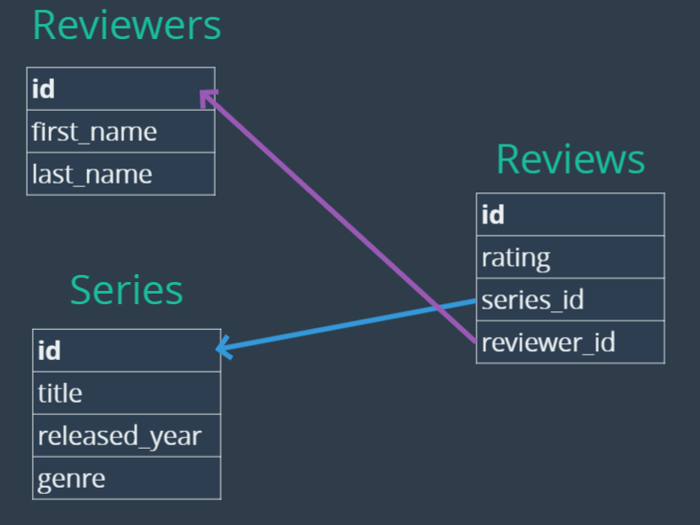
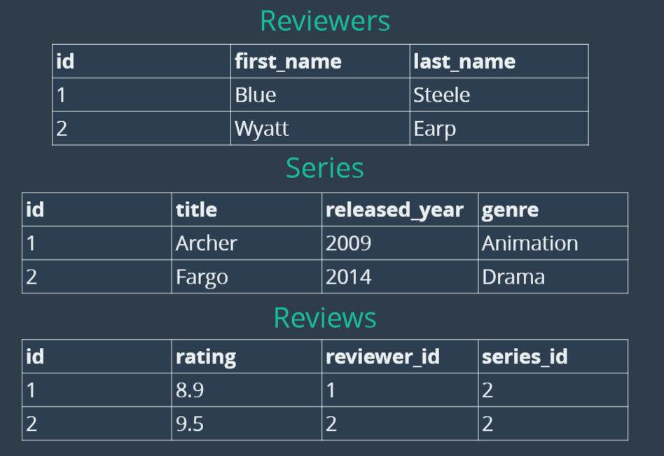

# <u>MySQL Master Bootcamp</u>

## General Notes

- Wildcards in __SQL__:
  - `%` (Any character)
  - `_` (Any character, but only results where there are the same amount of
    characters as there are underscores)
  - Escape the character if you need to use either
- To comment in __SQL__, use `--`, `/* */`, or `#`

# Section 2: Overview

## General Notes

- Some of the most common __DBMS's__ _(Database Management Systems)_:
    - PostgreSQL
    - MySQL
    - Oracle Database
    - SQLite
- _Types_ cannot be mixed and are specified upon creation. (Statically Typed)

## What is a Database?

1. A collection of data
    - I.e. a phone book
2. A method of accessing and manipulating that data
3. A structured set of computerized data with an accessible interface

## Database vs Database Management System

- __DMS__ or __Relational Database Management System__ refers to an interface
  for the data.
    - The database is the data itself and all of it. The __DBMS__ is the UI for it.
    - They're often referred to as the same thing

## MySQL vs SQL

### __SQL _(Structured Query Language)___

- The language we use to "talk" to our databases
- SQL is used to write inside of DBMS's such as MySQL
- There is a standard for how SQL should work, and all DBMS's are tasked with
  implementing that standard and making them work.

#### Two Takeaways

- It's very easy to switch after learning SQL
- What makes databases (DBMS) unique are the features they offer, not the language.

## Using __Goorm__ and __SQL__

- `mysql-ctrl {command}`
    - `start` (will start mysql)
    - `stop` (will stop mysql)
    - `cli` (Will stop and then start mysql)
        - Stands for ___Command Line Interface___
- `use {database_name}` (Changes the database being used)
- `source {database_filename}` (Run code from a query file)
- `desc {table}` (Shows the contents of a table)
    - Shorthand for `SHOW COLUMNS FROM {tablename}`
- `create {database_name}` (Creates a database)
- `drop {database_name}` (permanently destroys a database)
- `SELECT database()` (Tells you the current database being used)
- `show {tables | databases}` (Shows all tables or databases)

## What is a Table?

A table is a collection of related data held in a structured format within a
database.

- __Columns__ (Headers)

## Different __Types__ in SQL

|  Numeric  |   String   |   Date    |
|:---------:|:----------:|:---------:|
|    INT    |    CHAR    |   DATE    |
| SMALLINT  |  VARCHAR   | DATETIME  |
|  TINYINT  |   BINARY   | TIMESTAMP |
| MEDIUMINT | VARBINARY  |   TIME    |
|  BIGINT   |    BLOB    |   YEAR    |
|  DECIMAL  |  TINYBLOB  |           |
|  NUMERIC  | MEDIUMBLOB |           |
|   FLOAT   |  LONGBLOB  |           |
|  DOUBLE   |    TEXT    |           |
|    BIT    |  TINYTEXT  |           |
|           | MEDIUMTEXT |           |
|           |  LONGTEXT  |           |
|           |    ENUM    |           |

### SQL Types

- __INT__ (whole number)
- __varchar__ (variable-length string between 1-255 characters)

## Creating Tables

- Table names should be pluralized. It's because a table describes multiple of
  the thing, not just one.

```SQL
CREATE TABLE tablename
(
    column_name data_type,
    column_name data_type,
);

/* Example: */
CREATE TABLE cats
(
    name VARCHAR(100),
    age  INT
);
```

# Section 4: Inserting Data (And More)

## General Notes

- `SHOW WARNINGS` (Shows all warnings)
- `size` is a reserved word. Don't use it for a column name.

### Syntax

Incorrect syntax:

```sql
INSERT INTO <tablename>(column, column)
VALUES (value, value);
```

The preferred way of writing:

```sql
INSERT INTO <tablename>
            (column,
            column)
VALUES      (value,
            value);
```

- The order which the columns are used matters, as the order for the values being
  inserted must be in the same order.

## Multiple Inserts

```sql
INSERT INTO <tablename>
            (column type, column type)
VALUES      (value, value),
            (value, value),
            (value, value);
```

## NULL and NOT NULL

- When a value is not given for a column, `NULL` is put in its place.
- To require a value for a field:
```sql
CREATE TABLE <tablename>(column type NOT NULL);
```
  - The `NOT NULL` part throws a `warning` if the value is empty when being inserted.

## Setting Default Values
```sql
CREATE TABLE <tablename>
    (
        column type DEFAULT <default_value>
)
```

- It's important to specify `NOT NULL` as a value can still manually be set to 
  `NULL`.

## Primary Keys

- If you have multiple entries, you need to be able to tell them apart. That's
  when you use a __Primary Key__ ___(A unique identifier)___.

```sql
CREATE TABLE unique_cats (cat_id INT AUTO_INCREMENT NOT NULL
                         ,name VARCHAR(100)
                         ,age INT
                         ,PRIMARY KEY(cat_id)  /* Give the name of the field */
                          );

/* The second way to write it is to put PRIMARY KEY at the end */

CREATE TABLE unique_cats (cat_id INT AUTO_INCREMENT NOT NULL PRIMARY KEY
                         ,name VARCHAR(100)
                         ,age INT
                          );
```

- `AUTO_INCREMENT` will automatically increase the value for each entry.
  - It will appear under `EXTRA` when `DESC` is used.

It's possible to use two primary keys to make sure there's no duplicates of the
pair of those columns:
```sql
-- Likes Table. 
-- Ensures one photo will not have the same user liking multiple times
-- as both the photo_id and user_id pair must be unique in an entry
CREATE TABLE likes (
    photo_id INT NOT NULL,
    user_id INT NOT NULL,
    created_at TIMESTAMP DEFAULT NOW(),
    FOREIGN KEY(photo_id) REFERENCES photos(id),
    FOREIGN KEY(user_id) REFERENCES users(id),
    PRIMARY KEY(user_id, photo_id)
);

```

## CRUD

- __C__ reate
  - ```sql
    INSERT INTO
    ```
- __R__ ead
  - ```sql
    SELECT
    ```
    - Can use `*` or the name of a `column` or multiple `columns`
    - ```sql
      SELECT column, column from <table>;
      ```
- __U__ pdate
  - ```sql
    UPDATE <table> SET <column>=<value> WHERE <column>=<value>
    ```
- __D__ elete
- ```sql
    DELETE FROM <table> WHERE column=<value>;
    ```

Common in many areas of web development, not just databases.

### WHERE clause

Used to find specific information, not just check in on the table

  - I.e. Finding someone by their username and checking that their password matches
- Used almost everywhere
- **Case-insensitive**

```sql
SELECT * FROM <table> WHERE <column>=<value>;

/* Example */

SELECT * FROM cats WHERE age=4;
```

### Aliases

Specify how our data should be displayed back to us. Changes the name of the 
column temporarily to what's specified when it's displayed in a table.

```sql
SELECT column AS <temporary name>, column FROM <table>

/* Example */
SELECT cat_id AS id, name FROM cats;
```

- In this example `cat_id` has been changed to `id`. It's useful for when there
  are two databases with the same column. This way, you can tell them apart.

### Update

Good rule of thumb before updating is to run the equivalent `SELECT` to make sure
you're updating the correct data.

```sql
UPDATE table SET column=<value>
WHERE column=<value>;

/* Example */
UPDATE cats SET breed='Shorthair'
WHERE breed='Tabby';
```

### Delete

Same syntax as `SELECT`, except without a `column` after `DELETE`.

```sql
    DELETE FROM <table> WHERE column=<value>;
```

- The IDs will not shift when an item is deleted, as they're generated at
  creation.
  - This can be problematic if they were changed, as the IDs are often stored 
    in multiple tables.

# Section 7: String Functions

## General Notes

## Concat

`CONCAT` Combine data for cleaner output

```sql
SELECT CONCAT(column, column, 'text', ...) FROM <table>;
    
/* Example s*/
    
SELECT CONCAT(author_fname, ' ', author_lname) AS 'Full Name' FROM books;


SELECT author_fname AS first, author_lname AS last, 
CONCAT(author_fname, ' ', author_lname) AS 'Full Name' 
FROM books;
```

When dealing with multiple values that will all need a separator, using `CONCAT_WS` 
will save time:
```sql
SELECT CONCAT_WS(<separator>, column, column, ...) FROM <table>
```

## Substring

Work with parts of a string. `SUBSTR()` is the shorthand.

```sql
SELECT SUBSTRING(column, start, end) FROM <table>;

SELECT SUBSTRING('Hello World', 1, 4);
SELECT SUBSTR('Hello World', 1, 4);
```

- Unlike other programming languages like Python, the index does not start at 0.
- Only giving one number will produce all letters from there to the end.
  - i.e. `SELECT SUBSTRING('Hello World', 7)` will give `World`
  - Negative numbers are also applicable

### Combination Query Example

```sql
SELECT CONCAT
    (
        SUBSTRING(column, start, end),
        column/text,
        column/text
     ) AS 'My Concat'
FROM <table>;
```

## Replace

Replace parts of a string

```sql
SELECT REPLACE(text, text_to_replace, replacement_text)
FROM <table>;
```

- Replaces __all__ occurrences of `text_to_replace` with `replacement_text` in 
  the string
- It __is__ case-sensitive

## Reverse

Reverses a string

```sql
SELECT REVERSE(column) FROM <table>;
```

## Char_Length

Counts characters in a string. The long-form is `CHARACTER_LENGTH`.

```sql
SELECT CHAR_LENGTH(column) FROM <table>;
```

## UPPER and LOWER

Converts the string to either upper or lower-case.

```sql
SELECT UPPER(column) FROM <table>;

SELECT LOWER(column) FROM table;
```

# Section 8: Refining Our Selections

## General Notes

- Using Parenthesis `()` can create a __sub-query__ that will execute first.
  - This is slow though as `SELECT` is slow and two queries are being run

## Distinct

Used in conjunction with `SELECT`. If there's duplicates, it will only give the
unique ones.

- Comes right after `SELECT`

```sql
SELECT DISTINCT column FROM <table>;

-- Example

SELECT DISTINCT author_lname FROM books;
```

- To get a `DISTINCT` of multiple columns, you can either:
  - Use `CONCAT`
  - Use multiple columns:
    - ```sql
      SELECT DISTINCT column, column FROM <table>
      ```
      - Will only select unique columns where both values are unique. Applies 
        it to the entire row.

## ORDER BY

Sorting our results

```sql
SELECT column FROM <table> ORDER BY column;

-- Example

SELECT DISTINCT author_lname, author_fname 
FROM books 
ORDER BY author_lname;
```

- Ascending by default. Can be changed by assing `DESC` after the columns to sort
  by:
  - ```sql
    SELECT DISTINCT author_lname, author_fname 
    FROM books 
    ORDER BY author_lname DESC;
    ```
- Each selected column is given an index number starting from 1 that can be used
  as a shortcut, rather than typing the column:
  - ```sql
    SELECT DISTINCT author_lname, author_fname 
    FROM books 
    ORDER BY 2;
    -- This is ordering by author_fname
    ```
- It's possible to `ORDER BY` multiple columns. They will be ordered from left to
  right, prioritizing the column before it.
  - ```sql
    SELECT DISTINCT title, author_lname, author_fname 
    FROM books 
    ORDER BY title, author_lname;
    ```
    
## Limit

Specify a number for how many results to select.

- Used in conjunction with `ORDER BY`

```sql
SELECT column FROM <table> LIMIT <int>;

-- Examples

SELECT * FROM books LIMIT 3;

SELECT title, released_year FROM books
ORDER BY released_year DESC LIMIT 5;
```

- A range `<int>, <int>` can be given instead of a single number. The first number
  is the offset, and the second number is how many rows to fetch starting
  there _(including that row)_
  - An example of when to use this is a blog site for pagination.
  - To retrieve all rows from a certain offset, a number larger than the amount
    of rows can be given _(i.e. 99999999999999)_

## Like

Better searching. Allows the use of wildcards and partial matches using patterns.

```sql
SELECT * FROM <table> WHERE column LIKE '%<value>%';

-- Examples

-- Find all rows where author_fname contains 'da'
SELECT title, author_fname FROM books WHERE author_fname LIKE '%da%';

-- Find all rows where author_fname starts with 'da'
SELECT title, author_fname FROM books WHERE author_fname LIKE 'da%';

-- Find all rows where author_fname ends with 'da'
SELECT title, author_fname FROM books WHERE author_fname LIKE 'da%';

SELECT "(235)234-0987" LIKE '(___)___-____' ;
```

- This is __not__ case-sensitive

# Section 9: Aggregate Functions

## General Notes

## Count

Count how many of something are in a specific column, or all columns.

```sql
SELECT COUNT(*) FROM <table>;
SELECT COUNT(column) FROM <table>;
SELECT COUNT(DISTINCT column) FROM <table>;
SELECT COUNT(DISTINCT column, column) FROM <table>;
```

- Using `*` says to count all rows in `table`.
- `DISTINCT` needs to be used inside the parenthesis when using `COUNT`.
  - Multiple rows can only be used when `DISTINCT` is being used.
  - Using multiple columns when using `DISTINCT` will only return rows where both
    columns are unique.
- A super row is created and displayed 

## Group By

Summarizes or aggregates identical data into single rows

```sql
SELECT column, column FROM <table>
GROUP BY column;

-- COUNT here is counting how many sub-rows are in each row.
SELECT column, COUNT(*) FROM <table>
GROUP BY column;

-- Grouping by multiple columns will make sure both values are unique
SELECT column, column, COUNT(*) FROM <table>
GROUP BY column, column;

-- Example
SELECT title, author_lname FROM books
GROUP BY author_lname;
```

- Creates a super row containing all entries that meet the criteria, even though
  it may not be visually seen when displayed.
- Meant to be used with another aggregate function like `COUNT()`, and not by
  itself.
  - Newer versions will throw an error if it's used by itself.
- The `GROUP BY` is run first, and the `SELECT` applies to the groups created.

## MIN and MAX

Identify minimum and maximum values in a table.

```sql
SELECT MIN(column) FROM <table>;

SELECT MAX(column) FROM <table>;
```

- If used on a string, it will find the shortest or longest string

### A Problem:

Using `MIN` or `MAX` with another column will retrieve the first value in the
other column, independent of the max or minimum value.

### Solution:

#### Run a __Sub-query__

```sql
SELECT * FROM books
WHERE pages = (SELECT MIN(pages)
               FROM books);
```

- The sub-query will execute first.
- Slow method

#### Faster method:

```sql
SELECT * FROM books
ORDER BY pages LIMIT 1;
```

### Using Group By with Min / Max

```sql
SELECT      author_fname,
            author_lname,
            MIN(released_year)
FROM        books
GROUP BY    author_lname, 
            author_fname;
```

## Sum

Adds all values in a column.

```sql
SELECT SUM(column) FROM <table>;
```

- Does not work for strings. Will return `0`.

## Avg

```sql
SELECT AVG(column) FROM <table>;
```

- Does not work for strings. Will return `0`.
- Gives 4 decimal points, but does not round up the result.
  - Even if it's an even number, it will still give four `0`'s.

## Round

Rounds a number up to a given digit count

```sql
SELECT ROUND(1.234565, 2);
    -> 1.23
```

# Section 10: Data Types

## General Notes

## VARCHAR vs CHAR

- __`CHAR`__ has a fixed length that's specified upon table creation.
  - If it's fewer, it will add spaces to make it the specified number.
  - If it's longer, the rest will be chopped off.
  - Faster for fixed length text
    - Examples can be:
      - State abbreviations: CA, NY
      - Yes/No flags: Y/N
      - Sex: M/F
- __`VARCHAR`__ has a length that is specified, but does not have to be met with 
  each value.

|   Value   |  Char(4)  | Storage | Varchar(4) | Storage |
|:---------:|:---------:|:-------:|:----------:|:-------:|
|    ''     |   '  '    | 4 bytes |     ''     | 1 bytes |
|   'ab'    |  'ab  '   | 4 bytes |    'ab'    | 3 bytes |
|  'abcd'   |  'abcd'   | 4 bytes |   'abcd'   | 5 bytes |
| 'abcdefg' | 'abcdefg' | 4 bytes | 'abcdefg'  | 5 bytes |

## Int

Whole numbers

## Decimal

Fixed point __type__, and calculations are exact.

```sql
DECIMAL(<total num of digits>, <digits after decimal>);
    
-- Example
DECIMAL(5, 2);  -- 5 digits long, 2 decimal points after the number
```

- `DECIMAL` has a 0-30 range for decimal places.
- The decimal places count towards the total amount of digits.
- If a larger number is given than the amount of digits allowed, it will default
  to _9's_ equal to the amount of allowed digits. 
- Always use `DECIMAL`, unless precision doesn't matter.

## Float and Double

Floating-point __types__ and calculations are approximate.

| Data Type | Memory Needed | Precision Issues |
|:---------:|:-------------:|:----------------:|
|   FLOAT   |    4 Bytes    |    ~7 digits     |
|  DOUBLE   |    8 Bytes    |    ~15 digits    |

- After the above amount of digits under precision, each type will begin having
  precision issues.

## Dates, Times, DateTimes

More info can be found at [DateTime Fucntions Documentation](https://dev.mysql.com/doc/refman/8.0/en/date-and-time-functions.html)
and [DateTime Documentation](https://dev.mysql.com/doc/refman/8.0/en/datetime.html)

- `DATE` - `YYYY-MM-DD` (Value with a date, but no time)
- `TIME` - `HH:MM:SS` (Stores value with a time, but no date)
- `DATETIME` - `YYYY-MM-DD HH:MM:SS` (Values with a Date __and__ Time)
  - Use case: Storing when a row in a column is created

### Functions for Time, Date, and DateTime

- `CURDATE()` (Gives current date as a `DATE`)
  - Same thing as `CURRENT_DATE`
- `CURTIME()` (Gives current time as a `TIME`)
  - Same thing as `CURRENT_TIME`
- `NOW()` (Gives current datetime as a `DATETIME`)
  - Same thing as `CURRENT_TIMESTAMP`
- `DAY()` (Extracts day from `DATE` or `DATETIME`)
- `DAYNAME()` (Extracts & returns the name of the weekday)
- `DAYOFWEEK()` (Extracts & returns the number of that day within a week)
- `DAYOFYEAR()` (Extracts & returns the day of the year)
- `MINUTE()` (Extracts the minute)
- `MONTH()` (Extracts the month of the year)
- `MONTHNAME()` (Extracts & returns the name of the month)

### Using Date Formatter (DATE_FORMAT)

[Documentation](https://dev.mysql.com/doc/refman/8.0/en/date-and-time-functions.html#function_date-format)

```sql
SELECT DATE_FORMAT('2019-10-04 22:23:00', '%W %M %Y')
        -> Sunday October 2009
```

#### DATEDIFF, DATE_SUB, & DATE_ADD

[Add and Sub](https://dev.mysql.com/doc/refman/8.0/en/date-and-time-functions.html#function_date-add)

[Datediff](https://dev.mysql.com/doc/refman/8.0/en/date-and-time-functions.html#function_datediff)

```sql
-- Datediff
SELECT DATEDIFF(<datetime/date>, <datetime/date>);
        -> <Resulting datetime/date>
            
-- Example
mysql> SELECT DATEDIFF('2007-12-31 23:59:59','2007-12-30');
        -> 1

-- DATE_ADD
SELECT DATE_ADD(<datetime/date, INTERVAL <int> <Unit of time>);
        -> <Resulting datetime/date>

-- Example
SELECT DATE_ADD('2018-05-01',INTERVAL 1 DAY);
        -> '2018-05-02'
```

- It's not possible to chain together additions and subtractions this way.

It's also possible to just use `+/-` instead of a function.

```sql
SELECT <datetime/date> + INTERVAL <int> <Unit of time> FROM <table>;

SELECT <datetime/date> 
    + INTERVAL <int> <Unit of time> 
    + INTERVAL <int> <Unit of time> 
    FROM <table>;
```

- It's possible to chain together additions and subtractions this way.

### Timestamps

When used in tables, it's great to set `DEFAULT` to `NOW()`.

- `TIMESTAMP` supports `1970-01-01 00:00:01.000000` to `2038-01-19 03:14:07.999999`
- `DATETIME` supports `1000-01-01 00:00:00.000000` to `9999-12-31 23:59:59.999999`
- `TIMESTAMP` takes up half as many bytes as `DATETIME`

### ON UPDATE

Used in table creation. Says that whenever the table is updated, do that thing.

```sql
CREATE TABLE <table> (
    column <type> DEFAULT <value> ON UPDATE <function>
)

-- Example
CREATE TABLE comments (
    content_id INT NOT NULL AUTO_INCREMENT,
    content VARCHAR(100),
    modified_at TIMESTAMP DEFAULT NOW() ON UPDATE CURRENT_TIMESTAMP,
    PRIMARY KEY(content_id)
)
```

### YEAR

```sql
CREATE <table> (
    column YEAR(4) -- amount of numbers in the year
)
```

- `YEAR(2)` is deprecated

# Section 11: Logical Operators

## General Notes

- When comparing `CHAR`'s, it goes off ASCII values.

## Not Equal _or_ !=

Not equal to

```sql
SELECT column FROM <table> WHERE column != <value>;
```

## Not Like

```sql
SELECT column FROM <table> WHERE column NOT LIKE <value>;
```

## Greater Than _or_ >

Check that a value is greater than another value.

```sql
SELECT column FROM <table> WHERE <value> > <value>;
```
## Greater Than or Equal To _or_ >=

Check that a value is greater than or equal to another value.

```sql
SELECT column FROM <table> WHERE <value> >= <value>;
```

## Less Than _or_ >

Check that a value is less than another value.

```sql
SELECT column FROM <table> WHERE <value> < <value>;
```
## Less Than or Equal To _or_ >=

Check that a value is less than or equal to another value.

```sql
SELECT column FROM <table> WHERE <value> <= <value>;
```

## Logical AND _or_ &&

```sql
SELECT column FROM <table> WHERE <value>=<value> AND <value>=<value>;

SELECT column FROM <table> WHERE <value>=<value> && <value>=<value>;
```

## Logical OR _or_ ||

```sql
SELECT column FROM <table> WHERE <value>=<value> OR <value>=<value>;

SELECT column FROM <table> WHERE <value>=<value> || <value>=<value>;
```

## Cast

Converts a value to a different __type__ for use in an expression.

```sql
CAST('2017-05-02' AS DATETIME);
    
-- Example
SELECT birthdate FROM people
WHERE birthdate BETWEEN CAST('2017-05-02') AND CAST('2017-06-02');
```

## Between

Find a value between two values. Quicker than writing 
`<value> >= <value> && <value> <= <value>`

```sql
SELECT column FROM <table> WHERE column BETWEEN <value> AND <value>;
```

- The `AND` here is not the same as the `&&` operator, and must always be paired
  with `BETWEEN`.

## Not Between

Find a value between two values. Quicker than writing 
`<value> >= <value> && <value> <= <value>`

```sql
SELECT column FROM <table> WHERE column NOT BETWEEN <value> AND <value>;
```

- The `AND` here is not the same as the `&&` operator, and must always be paired
  with `NOT BETWEEN`.

## IN and NOT IN

Search that a value is in or not in a value.

```sql
-- In
SELECT column FROM <table>
WHERE column IN (<value to find>, <value to find>, <value to find>);

-- Not In
SELECT column FROM <table>
WHERE column NOT IN (<value to find>, <value to find>, <value to find>);
```

- `column` must be __in__ or __not in__ the values in order to meet criteria. 
  It's basically creating a list and checking that the column entry is in that
  list.
  - Can be slow when given a long list, as it iterates through each value,
    checking against them.

## Modulo _or_ %

Modulo operator. Divides by a given value, and returns the remainder.

```sql
SELECT column FROM <table> 
WHERE value % <value> = <value>;
```

## Case Statements

If a certain case is met, then perform a function.
- Control flow statement and the __sql__ version of `if else then` statements.

```sql
SELECT column,
    CASE
        WHEN <condition> THEN <function or value>
        ELSE <function or value>
    END AS <name of created column>
FROM <table>;
        
-- Example
SELECT title, released_year,
    CASE
        WHEN released_year >= 2000 THEN 'Modern Lit'
        WHEN released_year >= 2015 THEN 'Super Modern Lit'
        ELSE '20th Century Lit'
    END AS GENRE
FROM books;
```

- `column` is not necessary to select, and just the case can be selected.
- `AS` is not necessary and is an `ALIAS`.

#### IF

Checks a condition, and outputs a result based on it.

```sql
SELECT 
    IF(<condition>, <result if true>, <result if false>)
FROM <table>;
```

- Great when you don't need multiple outputs or conditional checks.

### Applying to a column rather than creating one:

#### `IS NULL`

```sql
SELECT 
    first_name, 
    last_name, 
    order_date, 
    amount IS NULL '0' -- Shorthand
FROM customers
LEFT JOIN orders
	ON customers.id = orders.customer_id;
GROUP BY customers.id
ORDER BY total_spent;
```

#### `IFNULL()`
```sql
IFNULL(<value1>, <value to sub if value1 is null)

SELECT 
    first_name, 
    last_name, 
    order_date, 
    IFNULL(SUM(amount), 0) AS total_spent -- Checks if null, and provides second argument if so
FROM customers
LEFT JOIN orders
	ON customers.id = orders.customer_id;
GROUP BY customers.id
ORDER BY total_spent;
```

### Checking for NULL

# Section 12: Relationships - One to Many

## General Notes

- When working with multiple tables, be explicit with which column belongs to
  which table.
  - Use `customers.id` instead of `id`.
- [Animated visual of joins](https://dataschool.com/how-to-teach-people-sql/left-right-join-animated/)

## Types of Relationships

- __One to One Relationship__
  - _Example:_ A customer has a customer detail table. Each customer has their own
    customer detail entry.
- __One to Many Relationship__
  - _Example:_ A book has many reviews. All of those reviews belong to one book.
  - The most common
  - Refers to how many values in a separate table each can have a relationship to,
    not how many tables.
- __Many to Many Relationship__
  - _Example:_ A two-way relationship. Books can have many authors, and those
    authors can have many books.
  - Refers to how many values in a separate table each can have a relationship to,
    not how many tables.

## One To Many

The most common relationship.

- The problem with having all the data in one table is duplicated info, and `NULL`
  entries where the data was not used for that row.

#### Example Relationship

|    Customers    |     Orders      |
|:---------------:|:---------------:|
| __customer_id__ |    order_id     |
|   first_name    |   order_date    |
|    last_name    |     amount      |
|      email      | __customer_id__ |

- The `customer_id` is what connects the two tables.

### Primary Key

The unique identifier for that table. There's only one of each value for that
column.

### Foreign Key

Reference to another table, within a table. 

- Refers to the `PRIMARY KEY` of a different table, creating the relationship.
- Creates a constraint
  - Throws an error when trying to add a non-existent key from the other table
  - Throws an error when trying to delete some data that other data is dependent
    upon.

```sql
-- Used at the end of table creation, as the last value
FOREIGN KEY(<key_from_current_table>) REFERENCES <table>(<PRIMARY KEY from that table>)
    
-- Example
CREATE TABLE customers (
    id INT NOT NULL AUTO_INCREMENT,
    first_name,
    last_name,
    email UNIQUE,
    PRIMARY KEY(id)
);

CREATE TABLE orders (
    id INT NOT NULL AUTO_INCREMENT PRIMARY KEY,
    order_date DATE,
    amount DECIMAL(8, 2),
    customer_id INT,
    FOREIGN KEY(customer_id) 
        REFERENCES customers(id)
);
```

- It's conventional when using a `FOREIGN KEY` to have the column be named the of
  the table it's referencing, followed by an underscore _, and then the name of
  the column.
  - `customer_id`
- Known as an __implicit join__

#### ON DELETE CASCADE

When a value is deleted that has a corresponding value from the foreign table,
delete that value as well.

```sql
CREATE TABLE orders (
    id INT NOT NULL AUTO_INCREMENT PRIMARY KEY,
    order_date DATE,
    amount DECIMAL(8, 2),
    customer_id INT,
    FOREIGN KEY(customer_id) 
        REFERENCES customers(id)
        ON DELETE CASCADE
```

### Cross Join

Almost never used and is an __Implicit Inner-Join__

```sql
SELECT * FROM table, table;

SELECT * FROM customers, orders WHERE customers.id = customer_id;
```

- Cartesian/cross join
- Creates every possible combination between two tables and is useless:
    - 

### Inner Join

__Explicit Inner-Join__

```sql
SELECT * FROM table
JOIN <table to join>
    ON <key from table 1> = <key from table 2>;

-- You can leave off INNER as it's implied
SELECT * FROM table
INNER JOIN <table to join>
    ON <key from table 1> = <key from table 2>;

-- Examples
SELECT * FROM customers
JOIN orders
    ON customers.id = orders.customer_id;

SELECT first_name, last_name, order_date, SUM(amount) AS total_spent FROM customers
JOIN orders
    ON customers.id = orders.customer_id
GROUP BY orders.customer_id
ORDER BY total_spent DESC;
```

- `JOIN` says the table to join
- `ON` will only add the value to the column being created if the two keys
  provided match.
  - The foreign key and primary key are typically provided.

### Left Join

Say there's table A and B. Selects everything from A, along with any matching
records in B.
- Takes all from table A, and the union of table B.
- Common convention

```sql
SELECT * FROM table
LEFT JOIN <table to join>
    ON <key from table 1> = <key from table 2>;
```

- An example of when to use this is if you're looking to see who's purchased with
  the business to email them.


### Right Join

Say there's table A and B. Selects everything from B, along with any matching
records in A.
- Takes all from table B, and the union of table A.
- Not common convention
  - Some IDE's and work environments don't even support it

```sql
SELECT * FROM table
RIGHT JOIN <table to join>
    ON <key from table 1> = <key from table 2>;
```

An example of when to use this is if someone accidentally deleted some customers
from your database, and you need to know who. By doing a `RIGHT JOIN` on your
orders, instead of a `LEFT JOIN`, it will be `NULL` for all customers that were
deleted.

```sql
SELECT
    IFNULL(first_name, 'MISSING') as first,
    IFNULL(last_name, 'USER') as last,
    order_date,
    amount,
    SUM(amount)
FROM customers
RIGHT JOIN orders
    ON customers.id = orders.customer_id
GROUP BY first_name, last_name
ORDER BY amount DESC;
```

# Section 14: Many-To-Many

## General Notes

### Example

1. 
2. 

## Working With Data

### Creating the tables

```sql
CREATE TABLE reviewers (
    id INT AUTO_INCREMENT PRIMARY KEY,
    first_name VARCHAR(100),
    last_name VARCHAR(100)
);

CREATE TABLE series (
    id INT AUTO_INCREMENT PRIMARY KEY,
    title VARCHAR(100),
    released_year YEAR(4),
    genre VARCHAR(100)
);

CREATE TABLE reviews (
    id INT AUTO_INCREMENT PRIMARY KEY,
    rating DECIMAL(2, 1),
    series_id INT,
    reviewer_id INT,
    FOREIGN KEY(series_id) REFERENCES series(id),
    FOREIGN KEY(reviewer_id) REFERENCES reviewers(id)
);

DESC reviewers;

DESC series;

DESC reviews;
```
### Inserting Values Into The Tables

```sql
INSERT INTO series (title, released_year, genre) VALUES
    ('Archer', 2009, 'Animation'),
    ('Arrested Development', 2003, 'Comedy'),
    ("Bob's Burgers", 2011, 'Animation'),
    ('Bojack Horseman', 2014, 'Animation'),
    ("Breaking Bad", 2008, 'Drama'),
    ('Curb Your Enthusiasm', 2000, 'Comedy'),
    ("Fargo", 2014, 'Drama'),
    ('Freaks and Geeks', 1999, 'Comedy'),
    ('General Hospital', 1963, 'Drama'),
    ('Halt and Catch Fire', 2014, 'Drama'),
    ('Malcolm In The Middle', 2000, 'Comedy'),
    ('Pushing Daisies', 2007, 'Comedy'),
    ('Seinfeld', 1989, 'Comedy'),
    ('Stranger Things', 2016, 'Drama');
    
INSERT INTO reviewers (first_name, last_name) VALUES
    ('Thomas', 'Stoneman'),
    ('Wyatt', 'Skaggs'),
    ('Kimbra', 'Masters'),
    ('Domingo', 'Cortes'),
    ('Colt', 'Steele'),
    ('Pinkie', 'Petit'),
    ('Marlon', 'Crafford');
    
INSERT INTO reviews(series_id, reviewer_id, rating) VALUES
    (1,1,8.0),(1,2,7.5),(1,3,8.5),(1,4,7.7),(1,5,8.9),
    (2,1,8.1),(2,4,6.0),(2,3,8.0),(2,6,8.4),(2,5,9.9),
    (3,1,7.0),(3,6,7.5),(3,4,8.0),(3,3,7.1),(3,5,8.0),
    (4,1,7.5),(4,3,7.8),(4,4,8.3),(4,2,7.6),(4,5,8.5),
    (5,1,9.5),(5,3,9.0),(5,4,9.1),(5,2,9.3),(5,5,9.9),
    (6,2,6.5),(6,3,7.8),(6,4,8.8),(6,2,8.4),(6,5,9.1),
    (7,2,9.1),(7,5,9.7),
    (8,4,8.5),(8,2,7.8),(8,6,8.8),(8,5,9.3),
    (9,2,5.5),(9,3,6.8),(9,4,5.8),(9,6,4.3),(9,5,4.5),
    (10,5,9.9),
    (13,3,8.0),(13,4,7.2),
    (14,2,8.5),(14,3,8.9),(14,4,8.9);
    
SELECT * FROM series;

SELECT * FROM reviewers;

SELECT * FROM reviews;
```

### Example Joins

#### Example 1

```sql
SELECT 
    CONCAT_WS(" ", first_name, last_name) AS full_name,
    title,
    rating
FROM reviews
INNER JOIN reviewers
    ON reviews.reviewer_id = reviewers.id
INNER JOIN series
    ON reviews.series_id = series.id
ORDER BY rating DESC;
```

#### Example 2
```sql
SELECT
    first_name,
    last_name,
    COUNT(rating) AS "COUNT",
    IFNULL(MIN(rating), 0.0) AS "MIN",
    IFNULL(MAX(rating), 0.0) AS "MAX",
    IFNULL(
        ROUND(
    		AVG(rating),
            2
    	),
        "0.00"
    ) AS "AVG",
    CASE
    	WHEN COUNT(rating) >= 1 THEN 'ACTIVE'
        ELSE 'INACTIVE'
    END AS STATUS
FROM reviewers
LEFT JOIN reviews
    ON reviews.reviewer_id = reviewers.id
GROUP BY reviewers.id
ORDER BY STATUS;
```

# Section 14: Instagram Database Clone

## General Notes

- If you will not be referencing a table, you don't always need to store an `id`.
- Ask questions before you start working with the data.

## Designing the Schema

A few things we need to store:

- Users
- Photos
- Comments
- Likes
- Hashtags
- Followers / followees

## Tagging Solutions:

The best solution is a combination of 1 and 2.

### Solution 1:


- Faster with uncommon tags.

### Solution 2:


### Solution 3:


- Fastest if working with common tags that are used often.
  - Not as fast with uncommon tags

## Creating The Tables

```sql
CREATE DATABASE ig_clone;
USE ig_clone;

-- Users Table
CREATE TABLE users (
    id INT AUTO_INCREMENT PRIMARY KEY,
    username VARCHAR(255) UNIQUE,
    created_at TIMESTAMP DEFAULT NOW()
);

-- Photos Table
CREATE TABLE photos (
    id INT AUTO_INCREMENT PRIMARY KEY,
    image_url VARCHAR(255) NOT NULL,
    user_id INT NOT NULL,
    created_at TIMESTAMP DEFAULT NOW(),
    FOREIGN KEY(user_id) REFERENCES users(id)
);

-- Comments Table
CREATE TABLE comments (
    id INT AUTO_INCREMENT PRIMARY KEY,
    comment_text VARCHAR(255) NOT NULL,
    user_id INT NOT NULL,
    photo_id INT NOT NULL,
    created_at TIMESTAMP DEFAULT NOW(),
    FOREIGN KEY(user_id) REFERENCES users(id),
    FOREIGN KEY(photo_id) REFERENCES photos(id)
);

-- Likes Table
CREATE TABLE likes (
    photo_id INT NOT NULL,
    user_id INT NOT NULL,
    created_at TIMESTAMP DEFAULT NOW(),
    FOREIGN KEY(photo_id) REFERENCES photos(id),
    FOREIGN KEY(user_id) REFERENCES users(id),
    PRIMARY KEY(user_id, photo_id)
);

-- Followers Table
-- Who follows who
CREATE TABLE follows (
    follower_id INT NOT NULL,
    followee_id INT NOT NULL,
    created_at TIMESTAMP DEFAULT NOW(),
    FOREIGN KEY (follower_id) REFERENCES users(id),
    FOREIGN KEY (followee_id) REFERENCES users(id),
    PRIMARY KEY(follower_id, followee_id)
);

-- Tags Table
CREATE TABLE tags (
    id INT AUTO_INCREMENT PRIMARY KEY,
    tag_name VARCHAR(255) UNIQUE,
    created_at TIMESTAMP DEFAULT NOW()
);

-- Photo Tags Table
-- Associate a tag with a photo
CREATE TABLE photo_tags (
    photo_id INT NOT NULL,
    tag_id INT NOT NULL,
    FOREIGN KEY (photo_id) REFERENCES photos(id),
    FOREIGN KEY (tag_id) REFERENCES tags(id),
    PRIMARY KEY(photo_id, tag_id)
);
```

## Inserting The Values

[Values](/static/ig_clone_data.sql)

## Having

Acts like `WHERE`, but takes grouped data and allows for filtering based off a
clause.
  - This is necessary, because `WHERE` comes __before__ `GROUP BY`, which means
    it's impossible to filter the data using `WHERE` when trying to also group.

# Section 16: Introducing Node

## What is Node?

- Javascript for backend
  - An implementation of javascript so that it can be used on the backend.
- Allows servers to be created so that another language like PHP or Ruby don't
  need to be used.

# Section 17: Building The Web App

## General Notes

- With __Express__, you add the tools you need as you need them.

## NPM

A better practice than using `npm install <package>` is to use `npm init`.
  - This creates a __package.json__ file and states what packages and their
    versions that have been installed.
  - Run `npm install --save <package>` after creating the package, so that a
    record is saved of each package installed.

To install multiple packages:
```js
npm install --save <package> <package> <package> 
```

## EJS (Embedded Javascript)

Templating language. An alternative to writing HTML that allows variables and
code logic to be included.
